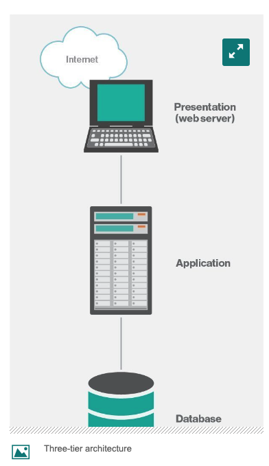

# my-first-website

This project is 3-tier application architecture 

A 3-tier application architecture is a modular client-server architecture that consists of a presentation tier, an application tier and a data tier. The data tier stores information, the application tier handles logic and the presentation tier is a graphical user interface (GUI) that communicates with the other two tiers. The three tiers are logical, not physical, and may or may not run on the same physical server

